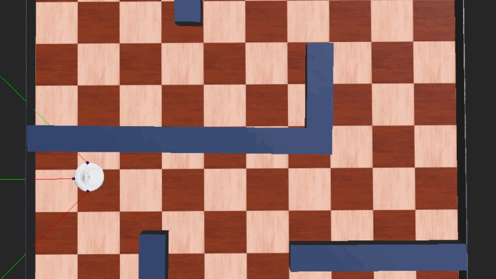

# 🤖 iRobot Create: Autonomous Maze Navigator (A* Baseline)

This repository features an autonomous navigation stack for an iRobot Create in Webots. It bridges classical A* pathfinding with GPS/Compass sensor fusion, serving as a baseline for my ongoing research into vision-driven autonomous navigation.
The current system architecture follows a Sense-Plan-Act loop, where GPS and Compass data are fused to ground the A* Pathfinding algorithm, which then generates motor commands for the iRobot Create differential-drive system.

## 📈 Research Evolution: Ground → Air

| Component | Folder | Status |
|-----------|--------|--------|
| [iRobot Controller](controller/) | Ground | ✅ Production |
| [Vision Transformer](vision-transformer/) | Drone | 🔄 Research |

**Progression**: Distance sensors → ViT+IMU fusion → Trajectory prediction

# 📖 Technical Report 

For a deep dive into the Webots environment setup, sensor calibration (GPS/Compass), and A* implementation details, read the [Technical Report](https://github.com/uttara-tech/Autonomous-Maze-Solver-Webots/blob/main/docs/Technical%20Report.pdf).

# 🚀 Technical Specifications

* **Path Planning** 

Integrated an A* pathfinding algorithm for optimal navigation on 4-connected discrete grids.

* **Sensor Fusion & Localization**

Synchronized GPS (global position) and Compass (heading) data to achieve sub-degree accuracy during 90-degree pivot turns.

* **Environment Discretization**

Developed a mapping layer that translates continuous 3D Webots coordinates into a 10x10 occupancy grid for real-time obstacle avoidance.

* **Kinematic Control**

Translated waypoint coordinates into Differential Drive wheel velocities, ensuring smooth trajectory execution.

## 📊 Baseline Performance Evaluation: iRobot A* Navigator

This section  outlines the benchmark results for the **A* Navigation Stack** on an iRobot Create (Roomba) within the Webots simulation environment. These metrics serve as the classical baseline for future integration with **Vision-driven Models**.

## 🚀 Mission Summary: Successful Goal Reach
The robot was tasked with navigating a 10x10 grid maze to reach the origin coordinates **(0,0)** using GPS and Compass for localization.

| Metric | Result |
| :--- | :--- |
| **Mission Status** | ✅ SUCCESS |
| **Goal Coordinates** | (0, 0) |
| **Completion Time** | 245.856 seconds |
| **Exploration (Mapped)** | 70 / 100 Cells (70%) |
| **Efficiency (Travelled)** | 42 / 100 Cells (42%) |

## 🔍 Technical Analysis
*   **Path Optimality** 

     The robot traversed 42% of the environment to reach the goal. This indicates that the **A\* Algorithm** successfully calculated a direct path while accounting for wall constraints.

*   **Mapping Performance** 

     A 70% mapping rate confirms the proximity sensors successfully identified "walkable" vs. "blocked" nodes, providing a reliable occupancy grid for the pathfinding library.
*   **Localization Stability** 

     The use of **GPS and Compass sensor fusion** allowed for sub-degree heading accuracy, ensuring the robot remained centered within the discrete grid cells during 90-degree turns.

## 🛠️ Roadmap & Future Iterations
This run establishes the **Baseline Competition Time** for the project. Future updates will focus on moving from "Heuristic-Based" to "Learning-Based" autonomy:
| Milestone | Status | Description |
| :--- | :--- | :--- |
| **Sensor Baseline** | ✅ Complete | Distance-sensor navigation; metrics: success rate, path efficiency. |
| **Vision Integration Prep** | 🔄 In Progress | Camera data collection and preprocessing for image-based policies. |
| **Advanced Policies** | ⏳ Planned | Explore vision-based RL (e.g., image observations → actions) and VLA models (e.g., vision+language → actions) for zero-shot/generalist navigation. |
| **Evaluation & Ablation** | ⏳ Planned | Compare against baseline across sim (Webots) and real-world transfer. |

*Note: Research draws from trends in embodied AI, including RL on visual states and VLA for instruction-following navigation.*

---
*Evaluation generated on: 22 March 2026*
